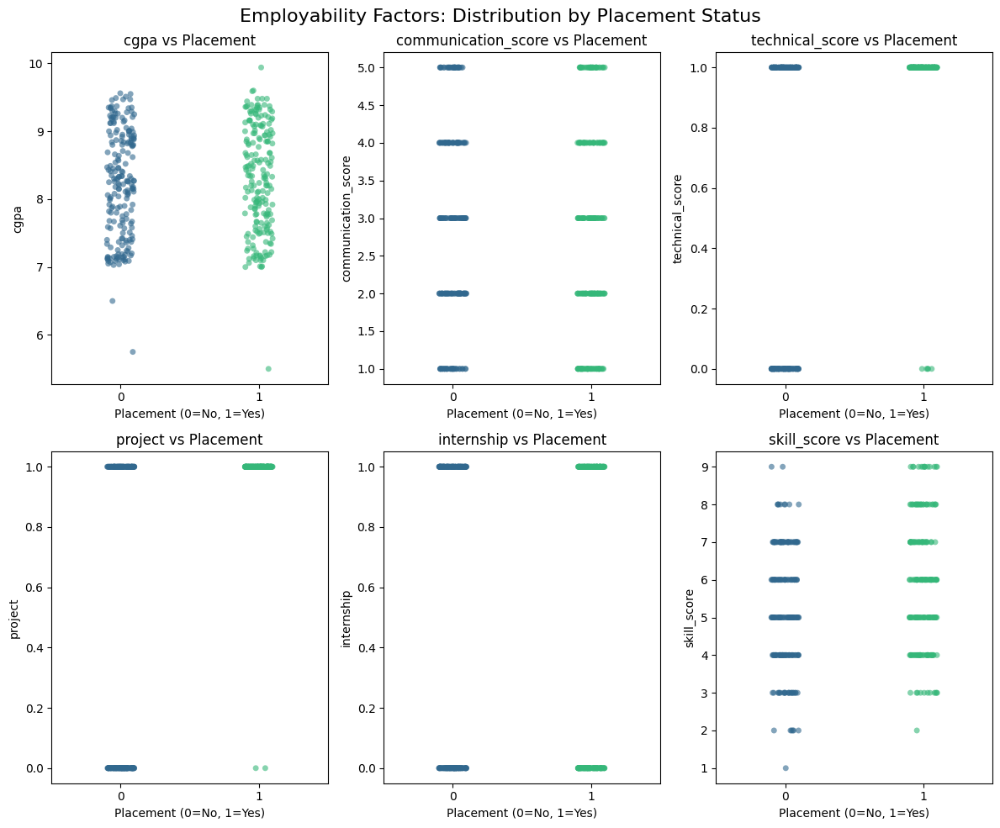

# Employability Analysis - India

## Problem Statement
Does academic performance predict employability among engineering
graduates in India?

## Tools Used
* Excel
* SQL
* Python
* Power BI

## Project Structure
```
employability-analysis/
├── data/
│   ├── raw/          # Raw datasets
│   └── processed/    # Cleaned datasets
├── excel/            # Excel analysis files
├── sql/              # SQL queries
├── python/           # Python scripts & notebooks
├── powerbi/          # Power BI dashboard files
├── README.md
└── requirements.txt
```

## Setup

1. Create conda environment:
```
   conda create -n employability_env python=3.10
```

2. Activate environment:
```
   conda activate employability_env
```

3. Install dependencies:
```
   pip install -r requirements.txt
```

## Key Findings

### 1. Overall Placement Performance

* Total Students: 401
* Placement Rate: 49.63%
* Only half of the students were successfully placed.

---

### 2. Academic Performance vs Employability

* High CGPA students: 50.95% placement rate
* Average CGPA students: 44.58% placement rate
* Minimal difference observed between categories

**Insight:**
Academic performance alone is not a strong predictor of employability.

---

### 3. CGPA vs Placement (Direct Comparison)

* Avg CGPA (Placed): 8.30
* Avg CGPA (Not Placed): 8.24

**Insight:**
There is negligible difference in academic scores between placed and non-placed students.

---

### 4. Skills Impact on Employability

* Avg Skill Score (Placed): 5.88
* Avg Skill Score (Not Placed): 5.21

**Insight:**
Students with higher skill scores are significantly more likely to be placed.

---

### 5. Skill Score Trend

* Placement rate increases with higher skill scores
* Strong positive relationship between practical exposure and employability

---

### 6. Backlogs Effect

* No backlog: 62.67% placement rate
* With backlog: 10.89% placement rate

**Insight:**
Backlogs severely reduce employability chances.

---

### 7. Communication Skills

* Moderate impact observed
* No strong linear relationship

---

## Final Conclusion

Academic performance alone does not guarantee employability among engineering graduates in India.

Skill-based factors such as internships, training, and project experience play a significantly more important role in determining placement outcomes. Additionally, academic consistency (absence of backlogs) is a critical factor influencing employability.

---

## Stream-wise Analysis

### 1. Skills vs Academic Performance Across Streams

* In most engineering streams, the gap in skill scores between placed and non-placed students is significantly higher than the gap in CGPA.
* Example:

  * Chemical Engineering: Skill Gap = 2.19 vs CGPA Gap = -0.18
  * Mechanical Engineering: Skill Gap = 1.31 vs CGPA Gap = -0.32

**Insight:**
Skills have a stronger influence on employability than academic performance across the majority of streams.

---

### 2. Streams Where Academic Performance Matters Slightly More

* Electrical Engineering and Civil Engineering show relatively higher CGPA impact compared to skill scores.

**Insight:**
Certain core branches still value academic performance, but the overall impact remains limited.

---

### 3. Placement Rate by Stream

* Highest placement rates observed in:

  * Electrical Engineering (64.86%)
  * CS in AIML (63.64%)
  * CS & Design (60.87%)
* Lower placement rates observed in:

  * Chemical Engineering (36.84%)
  * Electrical & Electronics Engineering (33.33%)

**Insight:**
Technology-oriented streams show better employability outcomes compared to core engineering branches.

---

### 4. CGPA vs Placement Across Streams

* CGPA values remain relatively consistent across streams (~8–8.5)
* Placement rates vary significantly

**Insight:**
Academic performance alone does not explain differences in employability across streams.

---

### 5. Skill Score vs Placement Across Streams

* Streams with higher average skill scores tend to have higher placement rates

**Insight:**
Practical exposure (internships, training, projects) is a key driver of employability.

---

## Stream-wise Conclusion

The importance of skills versus academic performance varies across engineering streams. However, in most cases, skill-based factors play a more significant role in determining employability than academic scores. Core engineering branches show relatively lower placement rates, indicating potential structural challenges in job alignment.

---


### Visual Analysis Insights



* CGPA shows no clear separation between placed and non-placed students, confirming its weak predictive power.
* Skill-based features such as projects and technical skills show stronger clustering among placed students.
* Skill score demonstrates a positive trend with placement but is not sufficient alone.
* Internship and communication do not show strong independent influence on placement outcomes.

**Key Insight:**
No single factor guarantees employability. However, practical exposure (projects, technical skills) plays a more significant role than academic performance.
